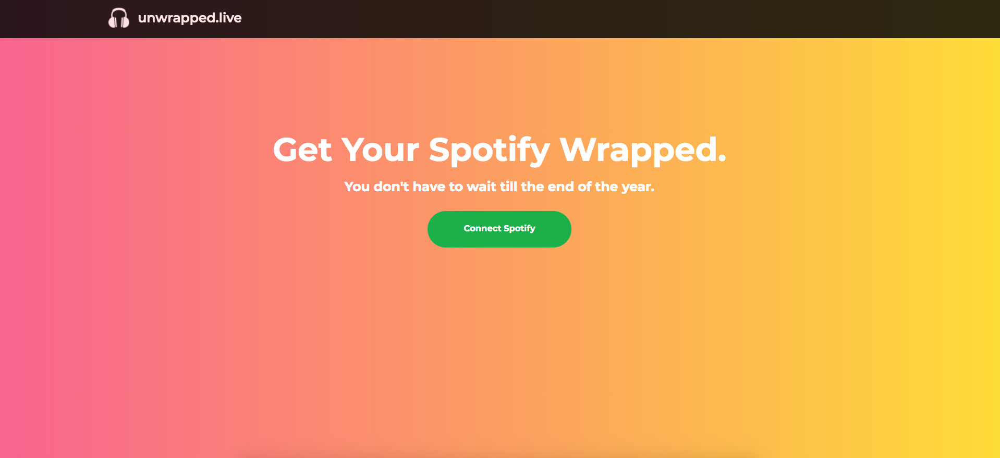

# unwrapped.live

A web application for viewing your annual Spotify Wrapped.

Available on : https://www.unwrapped.live

### Install

In order to run the application locally, you will need to clone the repository and build the backend and frontend seperately. 

#### Build Backend:

    cd server/src/unwrapped-live
    go build . -o unwrapped-live
    ./unwrapped-live

#### Build Frontend:
    
    cd unwrapped-live-client
    npm run dev

### Prerequisites

In order to run the application locally, you will need a Spotify API Client ID and Secret. You can get them from https://developer.spotify.com.

Once you have a Client ID and Secret, you will need to create a .env file in the /server/src/unwrapped-live directory and place the variables as follows:

    CLIENT_ID="YOUR_CLIENT_ID"
    CLIENT_SECRET="YOUR_CLIENT_SECRET"
    JWT_SECRET="YOUR_JWT_SECRET"

The server uses JWT tokens for securely transporting Spotify Access Tokens so make sure to assign the JWT_SECRET environment variable in the file as well.

